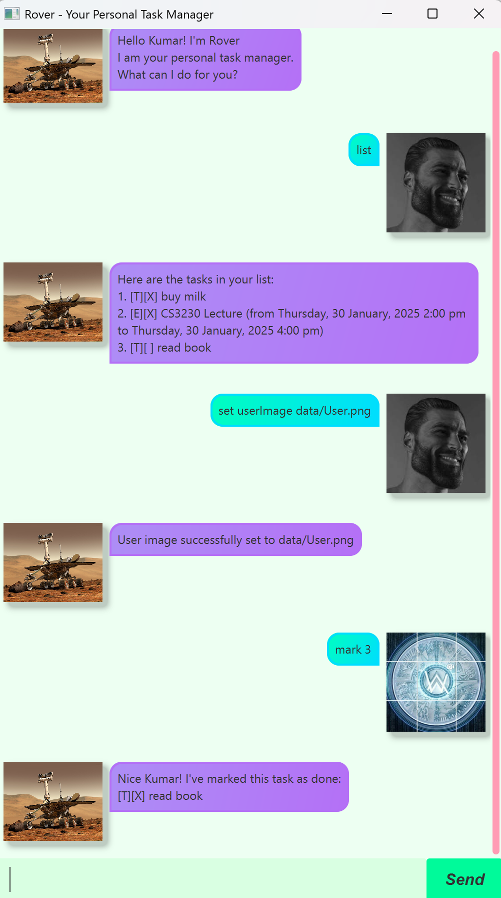

# Rover User Guide



Rover is a simple, command-based to-do list manager with an intuitive interface for adding, listing, and managing tasks efficiently.

## Adding Deadlines

You can add a deadline task by using the following command format:

**Example:**
```plaintext
deadline Finish report /by 21-02-25 23:59
```

### Expected Outcome:
- A new deadline task is added with the specified due date.
- The task will be displayed in the task list.

## Adding To-Do Tasks

To add a simple to-do task without deadlines, use:

**Example:**
```plaintext
todo Buy groceries
```

### Expected Outcome:
- The task is added without any time constraints.

## Adding Events

You can add an event by specifying a start and end time:

**Example:**
```plaintext
event Team meeting /from 20-02-25 10:00 /to 20-02-25 12:00
```

### Expected Outcome:
- An event task is created with a specified time range.

## Listing Tasks

To list all existing tasks, use:

```plaintext
list
```

### Expected Outcome:
- All saved tasks will be displayed with their statuses.

## Managing Tasks

### Marking a Task as Done

**Example:**
```plaintext
mark 1
```

### Expected Outcome:
- Marks the task at index 1 in the list as done.

### Marking a Task as Not Done

**Example:**
```plaintext
unmark 1
```

### Expected Outcome:
- Marks the task at index 1 in the list as not done.

### Deleting a Task

**Example:**
```plaintext
delete 1
```

### Expected Outcome:
- Deletes the task at index 1 in the list.

## Filtering Tasks

### Find Tasks by Keyword

**Example:**
```plaintext
find report
```

### Expected Outcome:
- Displays all tasks containing the keyword "report".

### Show Tasks Before a Certain Date

**Example:**
```plaintext
show before 01-03-25
```

### Show Tasks After a Certain Date

**Example:**
```plaintext
show after 15-02-25
```

## Setting User Preferences

### Set Your Name

**Example:**
```plaintext
set name John
```

### Expected Outcome:
- Your name will be updated.

### Set User Image

**Example:**
```plaintext
set userImage path/to/image.png
```

### Expected Outcome:
- Your profile picture used in the chat will be updated.

### Set Rover's Image

**Example:**
```plaintext
set roverImage path/to/rover.png
```

### Expected Outcome:
- Rover's profile picture used in the chat will be updated.

## Exiting the Application

To exit the program, use:

**Example:**
```plaintext
bye
```

### Expected Outcome:
- The program closes safely.